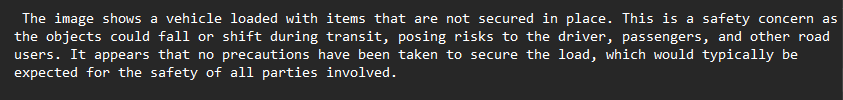
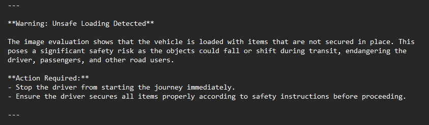

# AI-Image-Recognition
Ollama image recognition and further processing by OpenAI API Assistant

This project could serve as a basis for an AI-Implementation in a transportation truck company. It is about two AI Agent where one evaluates images of trucks loading safety and and the second one decides wether to give accordingly warnings to stop the transport in case loading safety is not sufficient for transportation. The idea behind this is that the transport manager doesn't have to manually check the received images anymore and outsourcing this work to AI. Images are evaluated only by a local open source model _Ollama_ and are not sent to a third party. This ensures 100% data privacy.

1) In the first section an input of an image simulates incoming images from truck drivers of their final consignment after loading. Consequently, the open source Ollama llm evaluates this image with the llava model. Since it is completly local the execution time takes about a minute. But the big advantage of this is that since it's running locally there are no privacy concerns on this. Depending on instructions the model creates a brief evaluation and stores it in a file.

2) In the second section an OpenAI API Assistant takes this evalution as an input and creates based on a prompt from prompts.py if necessary a warning to stop the transport and requests improved loading safety. This potential warning is finally safed in a second textfile in the output folder.

## Getting started

To set up this repo create a folder for the project on your system (instructions for windows), open a terminal window, write "cd" and paste the folder path `cd "C:\Users\user\path\to\your\folder"`. Then type `https://github.com/Yesitin/AI-Image-Recognition.git` to download the whole repository (ensure that you have installed python and git). 

Next, create a virtual environment in order to avoid dependency conflicts. For this, type into the terminal `python -m venv env`. With `env\Scripts\activate` you start the environment.

Now you can install all dependencies with `pip install -r requirements.txt`. 

As a last step, you have to create a .env file and insert and OpenAI key: `OPENAI_API_KEY=your_api_key`. Replace _your_api_key_ with your actual key.

Furthermore, you need to install Ollama _https://ollama.com/download/OllamaSetup.exe_. After completing, open a new terminal and type `ollama pull llava:7b` to download a streamlined model. You can also choose between 13b and 34b which are both way more powerful models. But also consider that they require more computing capacity. An overview can be found under _https://ollama.com/library/llava:13b_.

To finally run the project, execute main.py. Make sure to put the image in the input folder and adjust the image name. Furthermore, you can finetune the OpenAI-Agent by adjusting the temperature. Set a value between 0 to 1 where values closer to 0 mean more rational thinking and closer to 1 more creative thinking of the model. You can also adjust prompt if needed.

## Examples

1) Here is an exaggerated example of unsafe loaded vehicle:

2) Ollama gives a evaluation of the loading. It describes clearly that loading safety is not given: 

3) The OpenAI-Agent analyzed the evaluation and decides that a warning is absolutely necessary. It urges to stop the transport immediately:

